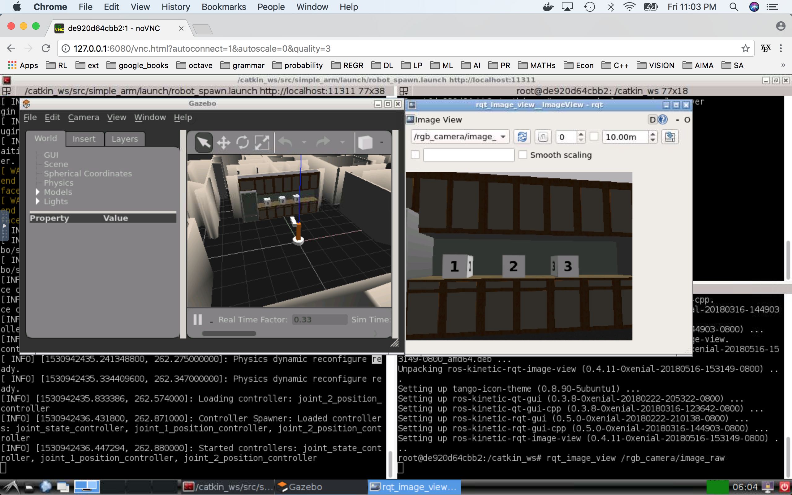

ros-vnc-desktop (Udacity Robotic Software Engineer Nano Degree)
=========================

Modified from '[team6612/ros-vnc-desktop](https://github.com/team6612/ros-vnc-desktop)'.

Docker image to provide HTML5 VNC interface with __ros:kinetic__ preinstalled.

Compatible with Udacity Robotic Software Engineer Nano Degree lectures and projects. 


```
docker build -t robond .
docker run -v <local_ws>:/catkin_ws -it -p 6080:80 robond 
```

Browse http://127.0.0.1:6080/

